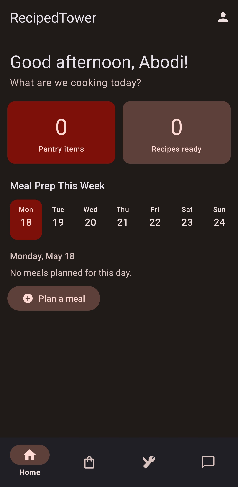
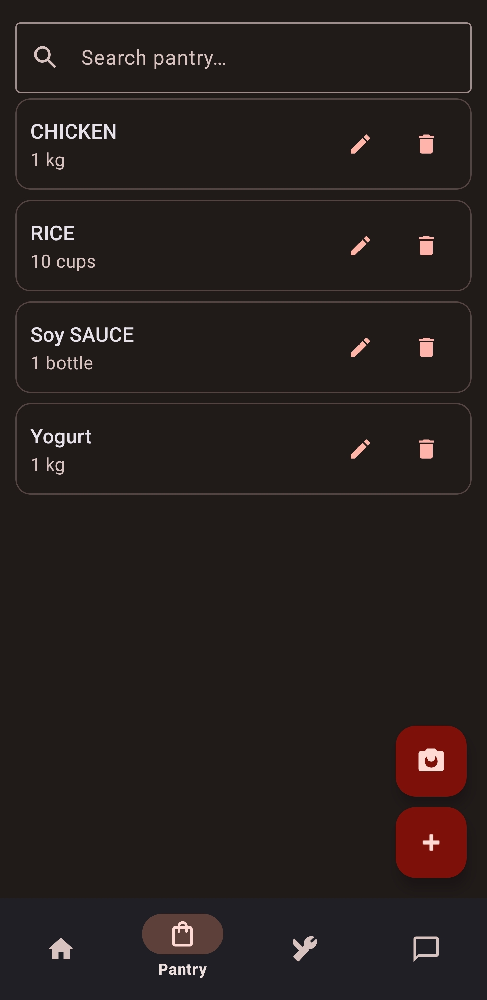
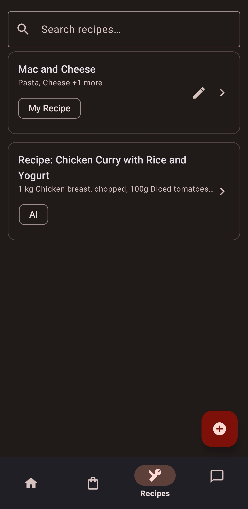
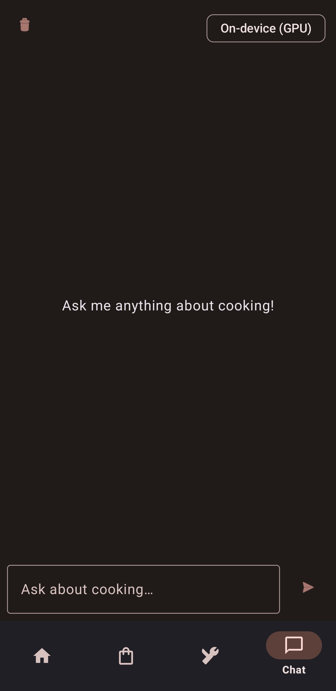
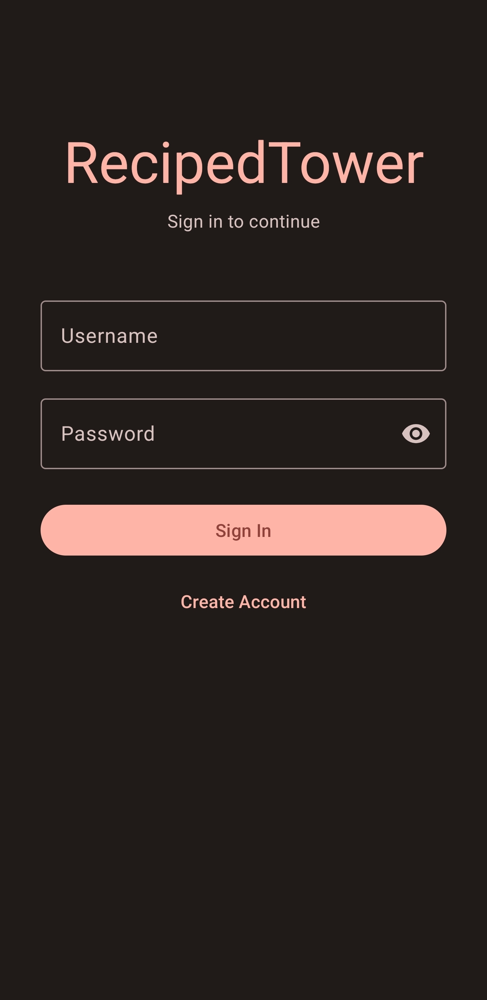

# SmartPantry AI

An Android application that simplifies daily meal planning by intelligently suggesting recipes based on ingredients already available to the user. SmartPantry AI uses on-device AI to automatically extract grocery data from receipts and generate personalised meal recommendations. It is entirely offline, with no data leaving the device.

---

## Screenshots

| Main Screen                                     | Pantry View                                     | Recipe                                          | Chat                                        | Login                                         |
|-------------------------------------------------|-------------------------------------------------|-------------------------------------------------|---------------------------------------------|-----------------------------------------------|
|  |  |  |  |  |

---

## Videos

- **App Demo:** [https://youtube.com/shorts/c6iTLM1GUJw]
- **Presentation:** [https://youtu.be/LRCwaG7l_H0]

---

## Features

- **Receipt Scanning** - Photograph a grocery receipt. ML Kit OCR extracts ingredient names and quantities automatically.
- **Pantry Tracking** - Ingredients are stored in a local Room database. No manual entry required but possible.
- **AI Recipe Generation** - On-device Gemma 2B generates context-aware recipes from your current pantry contents.
- **Offline-first** - All inference and data storage runs entirely on-device. No internet connection required after setup.

---

## Tech Stack

| Component | Technology |
|---|---|
| Language | Java |
| Architecture | MVVM |
| UI | XML Layouts + View Binding + Material 3 |
| Navigation | Jetpack Navigation Component (predictive back compatible) |
| Local Database | Room |
| OCR | ML Kit Text Recognition |
| On-device LLM | MediaPipe Tasks GenAI (Gemma 2B) |
| Image Loading | Glide |

---

## SDK Configuration

| Setting | Value |
|---|---|
| compileSdk | 36 |
| targetSdk | 35 |
| minSdk | 26 (Android 8.0) |
| versionName | 1.0 |

### Android 16 Compatibility

This app is compatible with Android 16 (API 36) behaviour changes. Back navigation uses the Jetpack Navigation Component with predictive back gesture support, conforming to Android 16's back navigation requirements.

### Tested On

| API Level | Type                               | Status |
|---|------------------------------------|---|
| API 36 (Android 16) | Personal Phone (Samsung S24 ULTRA) | Tested |

---

## LLM Integration

**Model:** gemma-2b-it-gpu-int4  
**Source:** [Kaggle - Google Gemma](https://www.kaggle.com/models/google/gemma)  
**Inference:** On-device via MediaPipe Tasks GenAI  
**Internet required:** No. All inference runs locally after the model is pushed to the device

### Why Gemma 2B?

Gemma 2B was chosen for its balance of capability and on-device efficiency. The `int4` GPU-quantised variant keeps the model at ~1.5 GB while remaining fast enough for real-time recipe generation on mid-range Android hardware. It supports instruction-following prompts which map well to the structured recipe generation task.

### Privacy

No user data is sent to any external server. All inference, OCR and database operations occur entirely on-device. The app functions fully offline once the model file is installed.

### Safety Handling

- Prompts are constrained to food and cooking contexts.
- Responses outside the cooking domain are filtered with a refusal message.
- Dietary restrictions and allergy preferences are respected via prompt constraints.

---

## Setup & Installation

### Requirements

| Requirement | Minimum |
|---|---|
| Android Studio | Panda 2025.3.1 Patch 1 or later |
| Android device RAM | 4 GB (8 GB+ recommended) |
| GPU | Adreno or Mali supported |
| Android version | Android 8.0+ (API 26), Android 12+ recommended |
| Model file | gemma-2b-it-gpu-int4.bin (~1.5 GB) |


### Step 1 - Download the Model

Download the Gemma model from Kaggle:  
**Model:** gemma-2b-it-gpu-int4  
👉 https://www.kaggle.com/models/google/gemma

After downloading:
1. Extract the .tar.gz archive
2. Locate gemma-2b-it-gpu-int4.bin (~1.5 GB)

### Step 2 - Enable Developer Options on Your Device

1. Go to **Settings → About Phone**
2. Tap **Build Number** 7 times to unlock Developer Options
3. Go to **Settings → Developer Options**
4. Enable **USB Debugging**

### Step 3 - Verify ADB Connection

Connect your device via USB, then run:

```bash
adb devices
```

Expected output:
```
R5CX12345   device
```

If it shows unauthorized, accept the USB debugging prompt on the device.

### Step 4 - Push the Model to the Device

```bash
adb push gemma-2b-it-gpu-int4.bin /data/local/tmp/
```

If using a full path on Windows:
```bash
adb push "C:\Users\YourName\Downloads\gemma-2b-it-gpu-int4.bin" /data/local/tmp/
```

This transfer may take several minutes.

### Step 5 - Verify the Model

```bash
adb shell ls -lh /data/local/tmp/gemma-2b-it-gpu-int4.bin
```

Expected output:
```
-rw-rw---- 1 shell shell 1.5G ...
```

### Step 6 - Build and Run

1. Open the project in Android Studio (Panda 2025.3.1 or later)
2. Let Gradle sync complete
3. Select your connected device
4. Click Run


---

## Development Methodology

This project followed an Agile iterative approach across weekly sprints

---

## Known Limitations

- Physical device strongly recommended. 
- First inference after cold launch may take 5–10 seconds while the model loads into memory
- Requires manual ADB model push

---

## Future Work

- In-app model download flow (eliminate manual ADB step)
- Meal planning calendar with weekly suggestions
- Barcode scanning as an alternative to receipt OCR
- Include a meal generator with different Carbs, proteins and sides